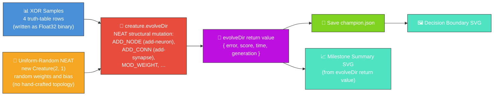
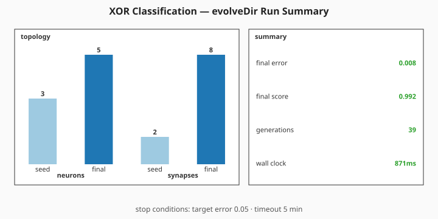

# 🧠 XOR Classification — Hello World of NEAT

> 🌱 **Generation 1 starts from random noise** — NEAT must invent the topology to solve XOR.

**Acronyms.** _NEAT_ = NeuroEvolution of Augmenting Topologies (the Stanley & Miikkulainen 2002
algorithm that grows topology and weights together). _XOR_ = exclusive OR (the two-input boolean
that returns true when exactly one input is true). _PRNG_ = pseudorandom number generator.

`xor_classification.ts` evolves a tiny NEAT-AI network that learns the XOR truth table — the
canonical "Hello World" of neuroevolution. The initial creature is built by the NEAT-AI library's
uniform-random `new Creature(2, 1)` constructor — direct input → output synapses with random weights
and a random output bias drawn from the seeded global PRNG. **No topology, weights, or biases are
hand-specified by this example.** The single output neuron's activation is pinned to `LOGISTIC` so
the `>= 0.5` classification threshold and the squared-error contribution against `{0, 1}` targets
are well-defined; everything else (hidden topology, weights, biases) is invented by NEAT. Structural
mutation — add-neuron, add-synapse and weight tuning — is delegated to `creature.evolveDir(...)`.
XOR is not linearly separable, so the random direct-only gen-1 seed cannot solve the task; NEAT must
invent at least one hidden neuron during evolution (issues #131, #148, audited under #205, telemetry
rewired under #301).

Stop conditions: `targetError` plus a `timeoutMinutes: 5` safety backstop (the tiny XOR problem
typically converges in well under a minute, but the backstop is mandatory so the runner cannot
wedge).


## 🔧 How It Works



## 🎯 Inputs and Outputs

| Channel  | Type    | Symbol | Meaning                                     |
| -------- | ------- | ------ | ------------------------------------------- |
| Input 0  | feature | `a`    | First operand of XOR (0 or 1)               |
| Input 1  | feature | `b`    | Second operand of XOR (0 or 1)              |
| Output 0 | scalar  | —      | `>= 0.5` predicts class `1`, else class `0` |

The XOR truth table:

| `a` | `b` | target |
| --- | --- | ------ |
| 0   | 0   | 0      |
| 0   | 1   | 1      |
| 1   | 0   | 1      |
| 1   | 1   | 0      |

Fitness is `1 - MSE` across the four samples; the task is "solved" when the mean squared error drops
below the configured `errorThreshold` (default `0.05`, equivalent to `>= 95%` per-sample fitness)
AND all four truth-table rows are classified correctly. A hard generation cap (`maxGenerations`,
default `2000`) bounds the run so the developer's screenshot run cannot wedge indefinitely if the
threshold is never reached — the loop stops, the run is reported as "did not solve", and the SVG
artefacts are still written.

## 🚀 Running the Example

> ⚡ **Speed note:** this example writes its training data in NEAT-AI's binary format — see
> [`docs/binary_training_stream.md`](../docs/binary_training_stream.md).

```bash
./xor_classification/run.sh
```

Artefacts:

- `.synthetic-xor/creatures/champion.json` – the fittest classifier from the run
- `docs/screenshots/xor_decision_boundary.svg` – the committed decision-boundary plot
- `docs/screenshots/xor_classification/evolution_summary.svg` – milestone summary chart sourced from
  `Creature.evolveDir`'s return value (final error/score, generations, wall-clock, seed vs final
  topology counts)

> [!TIP]
> The script writes its working data to `.synthetic-xor/`, a hidden directory ignored by git.

## 📈 Evolution milestone stats

The milestone summary chart below is generated **directly from the return value of
`Creature.evolveDir`**. The chart shows the seed and final topology counts side by side and the
numeric callouts for final error, final score, generations completed, and wall-clock time — i.e. the
canonical milestone surface called out in
[issue #298](https://github.com/stSoftwareAU/NEAT-AI-Examples/issues/298). No per-generation
telemetry is captured or emitted by this example any more (per issue #301).



## 🧠 Tacit Knowledge

A few things that are not obvious from the code alone:

- **The seed has no hidden neurons — NEAT must invent them.** `new Creature(2, 1)` produces a
  uniform-random network with two inputs wired directly to one output and zero hidden neurons. XOR
  is not linearly separable, so this seed _cannot_ solve the task — any solved champion is therefore
  proof that structural mutation (`ADD_NODE`, `ADD_CONN`) actually fired during the run. The random
  direct-only gen-1 seed plateaus near MSE ≈ 0.25; NEAT must invent at least one hidden neuron to
  break out of that plateau.
- **Solved-vs-cap.** The runner stops as soon as MSE drops below `errorThreshold` _and_ all four
  rows are classified correctly. If neither happens within `maxGenerations`, the run is reported as
  "did not solve" — but the milestone summary SVG is still written. The hard cap exists specifically
  to keep the screenshot regeneration pipeline from wedging indefinitely.
- **Mutation rate matters.** The library defaults (`mutationRate = 0.3`, `mutationAmount = 1`) are
  too conservative for a problem this small; the runner sets them to `0.6` and `3` so structural
  mutations fire often enough to bootstrap a hidden neuron in the early generations.
- **Reproducibility.** The seed flows through `NeatOptions.seed`, so two runs with the same seed
  produce the same champion JSON.
- **Decision boundary, not just labels.** The SVG shades the entire input square `[0, 1]²` by the
  network's continuous output, so you can see the boundary curve. Cleanly-separated XOR shows up as
  four diagonal "quadrants" of alternating colour.

---

> **Why this example was restructured.** Issue
> [#130](https://github.com/stSoftwareAU/NEAT-AI-Examples/issues/130) noticed that an earlier
> version of this demo started from a hand-fixed 2-2-1 topology and only mutated weights, so the
> neuron and synapse counts never changed. This page (and the screenshots) reflects the rewrite that
> replaced the hand-rolled loop with real NEAT structural mutation from a minimal random seed. Issue
> [#301](https://github.com/stSoftwareAU/NEAT-AI-Examples/issues/301) then retired the
> per-generation charts and checkpoint strip in favour of the milestone summary above.

## 🧰 NEAT-AI Features Used

XOR is the canonical neuroevolution "Hello World" — evolution from noise against a tiny supervised
target. The capability surfaced here is plain NEAT-AI evolutionary topology search.

> 🔎 **Stripped-down operator subset.** This example deliberately exercises a narrow slice of
> NEAT-AI's full pipeline so the noise → competent story stays uncluttered. The production training
> pipeline (backpropagation, dropout, L1/L2 regularisation, K-fold, binary `.bin` data streams,
> distributed evolution, etc.) is intentionally **not** wired into this demo — see issue
> [#185](https://github.com/stSoftwareAU/NEAT-AI-Examples/issues/185) and the upstream
> production-pipeline notes in
> [`COMPARISON.md`](https://github.com/stSoftwareAU/NEAT-AI/blob/Develop/COMPARISON.md) for the
> wider feature set.

Features exercised (links go to upstream
[`COMPARISON.md`](https://github.com/stSoftwareAU/NEAT-AI/blob/Develop/COMPARISON.md)):

- **[Evolutionary Topology Search](https://github.com/stSoftwareAU/NEAT-AI/blob/Develop/COMPARISON.md#what-weve-implemented)**
  — structural mutation (add-neuron / add-synapse) is mandatory because XOR is not linearly
  separable from the direct-only random seed.
- **[Genetic Operators](https://github.com/stSoftwareAU/NEAT-AI/blob/Develop/COMPARISON.md#what-weve-implemented)**
  — weight and bias mutation co-evolved with structure against the squared-error fitness signal.
