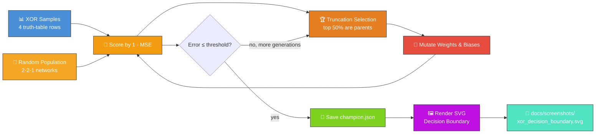

# 🧠 XOR Classification — Hello World of NEAT

`xor_classification.ts` evolves a tiny NEAT-AI network that learns the XOR truth table — the
canonical "Hello World" of neuroevolution. The data, the evolutionary loop, and the SVG renderer all
run in pure TypeScript; the only library dependency is NEAT-AI's `Creature.activate`.


## 🔧 How It Works



## 🎯 Inputs and Outputs

| Channel  | Type    | Symbol | Meaning                                     |
| -------- | ------- | ------ | ------------------------------------------- |
| Input 0  | feature | `a`    | First operand of XOR (0 or 1)               |
| Input 1  | feature | `b`    | Second operand of XOR (0 or 1)              |
| Output 0 | scalar  | —      | `>= 0.5` predicts class `1`, else class `0` |

The XOR truth table:

| `a` | `b` | target |
| --- | --- | ------ |
| 0   | 0   | 0      |
| 0   | 1   | 1      |
| 1   | 0   | 1      |
| 1   | 1   | 0      |

Fitness is `1 - MSE` across the four samples; the task is "solved" when the mean squared error drops
below the configured `errorThreshold` (default 0.05) and all four samples are classified correctly.

## 🚀 Running the Example

```bash
./xor_classification/run.sh
```

Artefacts:

- `.synthetic-xor/creatures/champion.json` – the fittest classifier from the run
- `docs/screenshots/xor_decision_boundary.svg` – the committed decision-boundary plot

> [!TIP]
> The script writes its working data to `.synthetic-xor/`, a hidden directory ignored by git.

## 🧠 Tacit Knowledge

A few things that are not obvious from the code alone:

- **Two hidden neurons are the minimum.** A purely linear `w·s + b` cannot represent XOR — the
  classes are not linearly separable. The example uses two TANH hidden neurons feeding a single
  LOGISTIC output, the smallest network that can solve the problem.
- **Reproducibility.** All randomness flows through `common/deterministic_random.ts`. With a fixed
  seed the same champion is produced on every run.
- **Decision boundary, not just labels.** The SVG shades the entire input square `[0, 1]²` by the
  network's continuous output, so you can see the boundary curve. Cleanly-separated XOR shows up as
  four diagonal "quadrants" of alternating colour.
